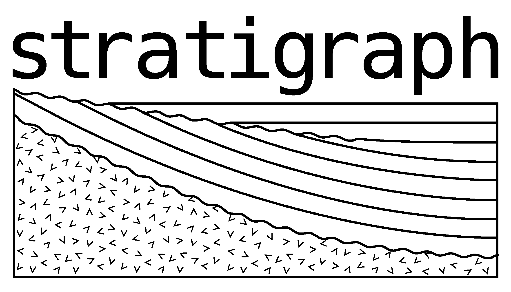
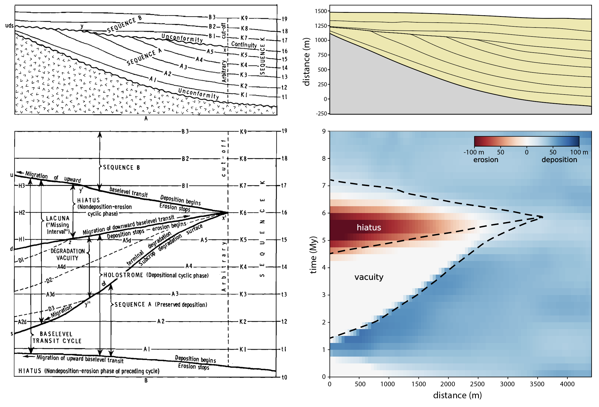
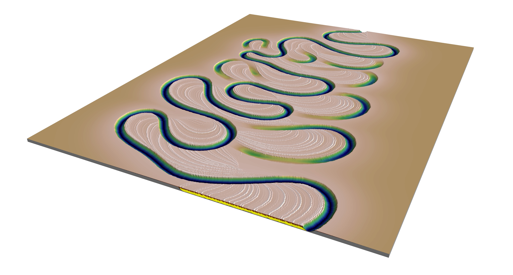

## stratigraph

`stratigraph` is a Python package for visualizing and analyzing stratigraphic models. These models ideally have the topographic surfaces through time, not just the stratigraphy, although it is possible to tweak the code so that stratigraphy-only models are visualized. The 3D visualizations rely on [Mayavi](https://docs.enthought.com/mayavi/mayavi/).

Stratigraphic data can be visualized in time or in space. In the time domain, `stratigraph` can be used create time-elevation (Barrell) plots and chronostratigraphic (Wheeler) diagrams. For example, here is the `stratigraph` version of Joseph Barrell's time-elevation plot from 1918:


Wheeler's first chronostratigraphic diagram (Wheeler, 1964) might look something like this:



`stratigraph` is best suited for more complex datasets, for example the ones derived from experiments where the surface topography is carefully tracked through time. For example, this is a dip section through the deposits of the XES-02 experiment, which was run at St. Anthony Falls Laboratory, University of Minnesota:


The cross section in the upper panel is colored by water depth (not grain size); the lower panel shows the corresponding Wheeler diagram.

`stratigraph` can also be used to display stratigraphic models in 3D; for example, this is a meandering river model (created with 'meanderpy'):



If you want to show more of the stratigraphy, you can create an 'exploded view':


The four Jupyter notebooks in [this folder](notebooks) illustrate the ways `stratigraph` can be used to visualize stratigraphy.

For more details, see [this paper](https://doi.org/10.1016/j.earscirev.2024.104706).

## Requirements

The following packages are required and will be installed when you install `stratigraph`.

- `matplotlib`
- `numpy`
- `mayavi`
- `scipy`
- `scikit-learn`
- `scikit-image`
- `Pillow`
- `shapely`
- `tqdm`

To run the Jupyter Notebooks, you will also need `jupyter` and `pandas`. See also the `requirements.yml` file. This file can be used to create a virtual environment.

## Installation

First install `mayavi` according to [the installation instructions](https://docs.enthought.com/mayavi/mayavi/installation.html). You can also install it with Conda: `conda install -c conda-forge mayavi`.

`stratigraph` can be installed using `pip`:

```shell
pip install stratigraph
```

## Citing stratigraph

If you use `stratigraph` in your work, please cite this paper:
<blockquote>
Sylvester, Z., Straub, K. M., and Covault, J. A. (2024), Stratigraphy in space and time: A reproducible approach to analysis and visualization, Earth Science Reviews, v. 250, 104706. <a href="https://doi.org/10.1016/j.earscirev.2024.104706">https://doi.org/10.1016/j.earscirev.2024.104706</a>
</blockquote>